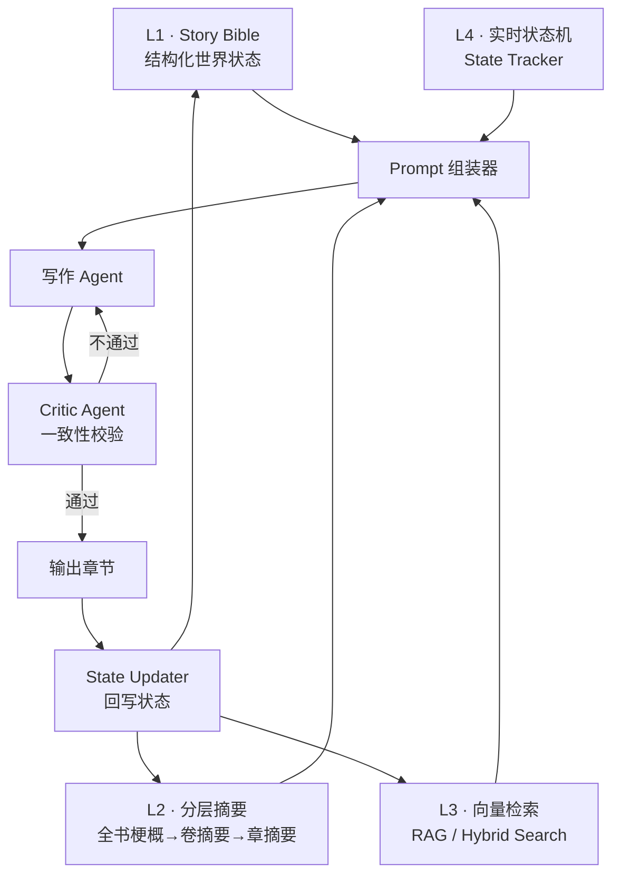
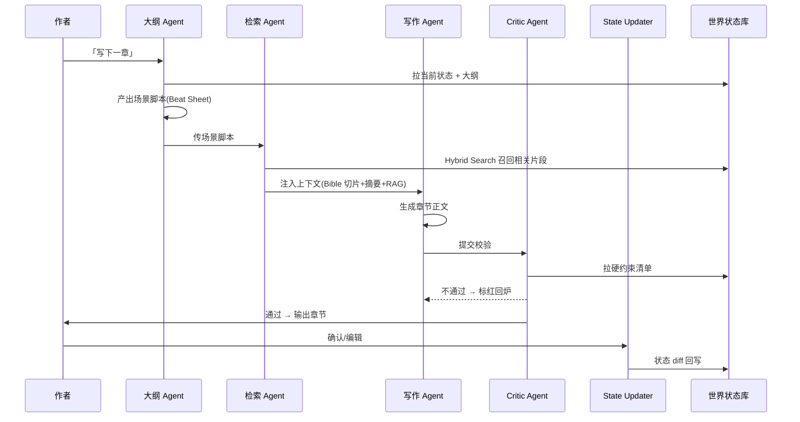
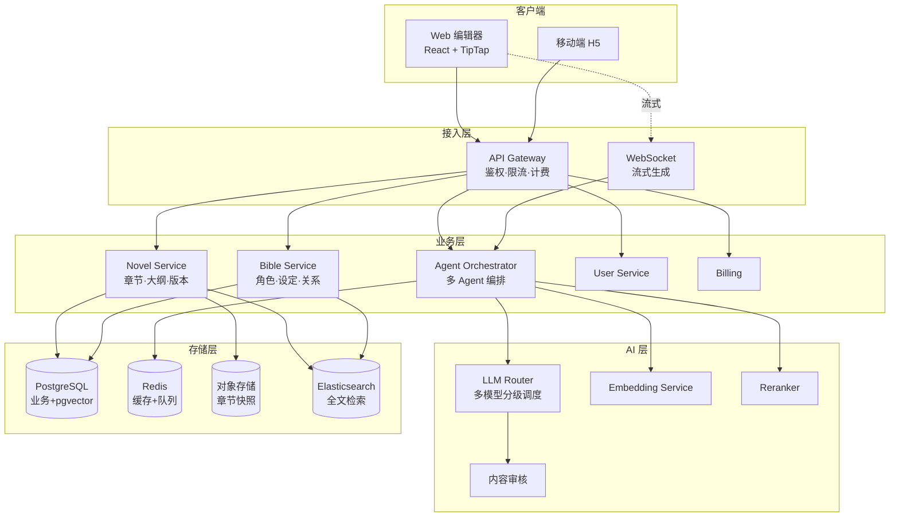
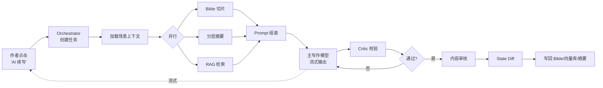
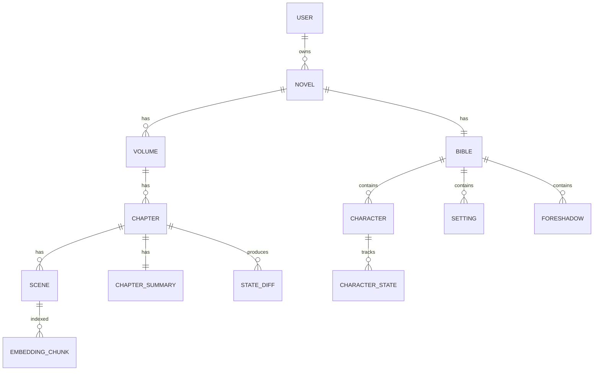
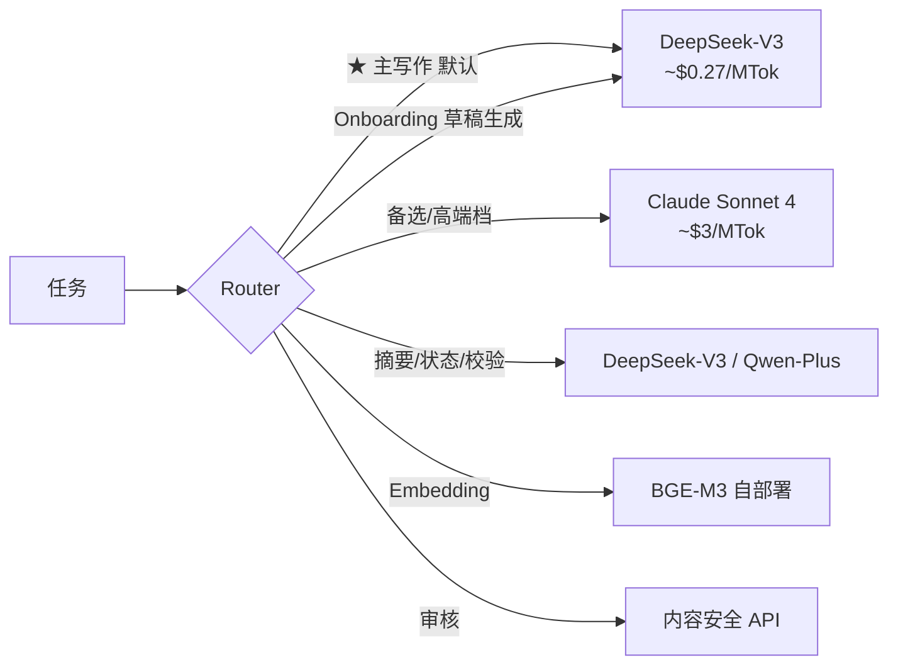

# AI小说网站技术实现方案 v1.0

<aside>
🎯

**一句话定位**:一个面向网文/长篇创作者的 AI 协同写作平台,核心解决「长上下文导致的人设崩塌、剧情失忆、伏笔丢失」三大痛点,用**结构化世界状态 + 分层记忆 + 多 Agent 协同**替代「单次塞入超长 prompt」的朴素做法。

</aside>

## 一、项目介绍

### 1.1 产品定位

面向中长篇小说(尤其网文,10 万字以上)创作者的 AI 写作 Copilot,而非「一键生成爽文」工具。强调**人机共创**:作者掌控大纲与世界观,AI 负责扩写、续写、校验、检索。

### 1.2 目标用户(全覆盖,通过「小说档案」配置区分)

- 网文作者(起点、番茄、晋江等平台连载作者)— 主力场景
- 编剧、剧本杀作者
- 严肃文学/纯文学爱好者
- 业余长篇爱好者
- 内容工作室(批量产出团队)

<aside>
💡

**不在产品层面强制二选一**(网文派 vs 严肃派)。通过用户在创建项目时填写的**小说档案 (Novel Profile)** 动态调整 Prompt 模板、节奏检测、审核等级、风格预设——同一套底层引擎服务所有类型,档案随时可改。

</aside>

### 1.3 核心功能

- [ ]  **小说档案配置**:类型/调性/节奏/字数/视角/自由度等可调整,影响全链路生成行为
- [ ]  **轻量化 Onboarding**:一句话灵感 → AI 反向生成 Bible 草稿 → 一键开写
- [ ]  **世界观管理**:角色卡、设定库、时间线、关系图
- [ ]  **大纲驱动写作**:卷 → 章 → 场景三级大纲
- [ ]  **AI 续写/扩写**:基于上下文状态生成,带一致性校验
- [ ]  **智能检索**:跨章节回忆,伏笔追踪
- [ ]  **风格控制**:文风样本注入、语气锚点
- [ ]  **协作版本**:历史版本、分支创作、多人协作
- [ ]  **导出**:Markdown / EPUB / Word / 平台直发

### 1.4 与同类产品的差异化

| 维度 | 同类产品(Sudowrite/蛙蛙写作 等) | 本项目 |
| --- | --- | --- |
| 记忆方式 | 长 context 或简单摘要 | 分层记忆 + 结构化状态机 |
| 一致性保障 | 依赖模型自身能力 | 独立 Critic Agent + 硬约束注入 |
| 用户控制 | 黑盒生成 | 世界观可编辑、状态可追溯 |
| 成本 | 每章直接调大模型 | 分级模型 + Prompt Cache |

### 1.5 小说档案 Novel Profile(配置驱动)

所有用户共享一套引擎,通过**项目级配置**区分玩法。配置可随时修改,影响后续章节生成行为。

| 字段 | 选项示例 | 影响的链路 |
| --- | --- | --- |
| 类型大类 | 网文 / 严肃文学 / 剧本 / 同人 / 短篇集 | Prompt 模板、章节粒度、Bible 字段权重 |
| 子类型 | 玄幻/都市/言情/科幻/悬疑/历史/武侠/系统流/无限流… | 流派 few-shot 样本、套路库 |
| 目标读者 | 男频 / 女频 / 通用 / 青少年 | 内容审核等级、爽点权重 |
| 篇幅 | 短篇(<5万)/ 中篇 / 长篇 / 超长篇(>200万) | 摘要压缩策略、卷划分阈值 |
| 调性 | 爽文 / 正剧 / 治愈 / 黑深 / 幽默 | 风格 prompt 倾向 |
| 节奏 | 快节奏(开局即巅峰)/ 中速 / 慢热 | 单章信息密度、Beat Sheet 节拍数 |
| 视角 | 第一人称 / 第三人称限定 / 上帝视角 | 写作 prompt 强约束、Critic 检查项 |
| 章节字数 | 2k / 3k / 5k(网文常见) | 单次生成长度、付费章卡点 |
| 文风预设 | 起点爽文 / 番茄轻松 / 晋江细腻 / 严肃文学 / 自定义 | 风格样本注入 |
| AI 自由度 | 保守(贴大纲)/ 中等 / 放飞 | temperature、偏离允许度 |
| 合规等级 | 标准 / 严格(青少年向) | 审核阈值、敏感词库 |

这些字段不全是必填——只要选了「类型大类 + 子类型」就能开写,其他用默认值,后续随时回来调。

### 1.6 轻量 Onboarding 流程(一句话开书)

<aside>
✨

**核心原则**:用户填的越少越好,AI 帮他扩展。完整流程 ≤ 3 分钟,且**永远可以「先开写,后完善」**——所有 Bible 字段都允许空白,写作中遇到再补。

</aside>


**Step 1 · 基础信息(30 秒)**

- 书名(可空,后补)
- 类型大类(单选)
- 子类型(单选,前 6 个热门 + 「其他」)

**Step 2 · 一句话灵感 / Logline(1 分钟)**

- 一个大输入框,占位文案引导:「用 1–2 句话告诉我你想写的故事。例如:一个被废柴宗门收留的少年,意外觉醒了上古剑魂…」
- 没想好? → 点「AI 推荐」,基于子类型生成 5 个 logline 让用户挑或继续重摇

**Step 3 · AI 反向追问(1 分钟)**

基于 logline,AI 实时生成 3–5 道**选择题**(单选/多选 + 一个「自定义」),用户点点就行。例如:

- 主角性格?(冷静理智 / 热血莽撞 / 腹黑算计 / 自定义)
- 主线节奏?(开局即巅峰 / 缓慢成长 / 多线并进)
- 核心爽点?(打脸 / 扮猪吃虎 / 收徒养成 / 拯救苍生 …)
- 期望篇幅 / 文风偏好(自动从档案带入,可改)

**Step 4 · AI 一次性生成 Bible 草稿(自动,3–5 秒流式)**

调用 1 次 DeepSeek-V3 产出:

- 主角 + 关键 NPC 角色卡(3–5 个)
- 世界观核心设定(势力 / 规则体系 / 地理)
- 开篇卷大纲(~10 章梗概)
- 第 1 章 Beat Sheet(直接可用)

**Step 5 · 调整或直接开写**

- 进入「Bible 总览页」,卡片化展示,点开即可编辑
- 或者跳过,直接「开始写第 1 章」

#### 写作过程中的渐进补完(关键设计)

- **自动登记**:写作时若 Critic 检测到新角色/新设定,弹出「检测到未登记角色 'XXX',1 秒登记?」,自动填好可编辑字段
- **空字段问询**:Bible 里的关键空字段(比如主角的「核心动机」没填),写到相关情节时 AI 主动问一句,而不是硬编
- **一键重摇**:Onboarding 任何一步都能回退、重生成、清空重来,降低决策压力
- **档案可改**:进入主编辑器后,小说档案永远在右侧抽屉里,改完立刻影响下一次生成

---

## 二、核心问题与挑战

### 2.1 第一性问题:长程一致性

<aside>
⚠️

**根本矛盾**:小说是线性长文本(常 50–500 万字),而 LLM 的注意力是稀疏的、上下文是有限的、记忆是无状态的。

</aside>

具体表现为四类幻觉:

1. **人物幻觉**:角色突然「复活」、性格突变、能力错位、外貌前后矛盾
2. **剧情幻觉**:遗忘已发生事件、伏笔不回收、时间线错乱
3. **设定幻觉**:违反世界观规则(如修炼体系、魔法规则)
4. **风格幻觉**:文风/语气/叙事视角漂移

### 2.2 衍生挑战

- **成本爆炸**:朴素方案每章 10w+ token,百章成本不可承受
- **延迟**:超长 context 导致首字延迟数十秒,体验差
- **作者改稿后的状态同步**:用户手动改了第 5 章,后续状态如何级联更新
- **风格与事实的双重约束**:既要文笔好,又要不违反 Bible
- **检索失败的静默幻觉**:RAG 没召回时,模型不会说「不知道」,而是编造
- **评估困难**:一致性没有标准 benchmark,需自建测试集
- **合规风险**:涉政/涉黄/未成年人保护,中文场景尤其敏感

---

## 三、整体解决方案

### 3.1 设计哲学

<aside>
💡

**不要让 LLM「记住」小说,而是把小说工程化为「可结构化的状态 + 可检索的素材 + 可压缩的摘要」**,LLM 每次只看「与当前段落最相关的子集」。

类比:LLM 是渲染器,真正的世界状态在外部数据库里——像游戏的存档系统。

</aside>

### 3.2 四层记忆架构



#### L1 · Story Bible(故事圣经)

用结构化存储(关系数据库 + JSON),不是自由文本:

- **角色卡**:姓名、外貌、性格、口头禅、能力、关系网、目标、秘密、当前状态
- **世界设定**:地理、势力、规则体系、时间线
- **物品/线索**:关键道具、未回收伏笔列表
- **大纲**:卷/章/场景三级金字塔

#### L2 · 分层摘要

- 章摘要(每章 200–500 字,含「事件」+「状态变更」两份)
- 卷摘要(每 5–10 章压缩)
- 全书梗概(始终最新)

#### L3 · 向量检索(RAG)

- 按场景切块 → embedding → 向量库
- Hybrid Search(BM25 + 向量)+ Reranker
- 检索 query 用结构化字段(人物+地点+关键词),不用散文

#### L4 · 实时状态机

每章生成后,自动 diff 出状态变更,写回 Bible:

- 角色位置 / HP / 情绪
- 关系值变化
- 已揭示伏笔 / 已使用道具
- 时间推进

### 3.3 多 Agent 协同流程



---

## 四、系统架构

### 4.1 分层架构图



### 4.2 数据流(写一章的完整路径)



---

## 五、技术选型

| 层 | 技术 | 理由 |
| --- | --- | --- |
| 前端框架 | Vite + React 18 + TypeScript | 与你现有技术栈一致 |
| 编辑器 | TipTap (基于 ProseMirror) | 支持流式插入、自定义节点(角色卡内联) |
| UI | TailwindCSS + shadcn/ui | 开发效率高,组件可定制 |
| 状态管理 | Zustand + TanStack Query | 轻量,服务端状态分离 |
| 后端 | Node.js + Hono / NestJS | Hono 轻量适合边缘,NestJS 适合大型工程 |
| LLM SDK | Vercel AI SDK / LangChain.js | 统一多厂商接口,流式支持好 |
| 主写作模型(已锁定) | **DeepSeek-V3** | 中文质量优秀、成本极低($0.27/MTok 输入),性价比首选;Router 层保留多模型抽象,后续可平滑接入备选模型做 A/B |
| 辅助模型(摘要/校验/状态) | Gemini Flash / Qwen-Plus / DeepSeek-V3 | 成本低 10–20 倍 |
| Embedding | BGE-M3 / OpenAI text-embedding-3 | 中文支持好,自部署可选 |
| 向量库 | pgvector(初期) / Milvus(规模化) | 初期不引入新组件,降复杂度 |
| 关系数据库 | PostgreSQL 16 | JSONB + pgvector + 全文检索一体 |
| 缓存/队列 | Redis + BullMQ | 异步生成任务、限流、Prompt 缓存 |
| 对象存储 | S3 / R2 / OSS | 章节快照、用户上传素材 |
| 实时通信 | WebSocket + SSE | 流式生成下发 |
| 部署 | Docker + K8s / Vercel + Cloudflare | 视团队规模选 |
| 监控 | OpenTelemetry + Langfuse | LLM 调用链追踪、成本分析 |

---

## 六、数据模型设计(核心表)

### 6.1 ER 关系



### 6.2 关键表结构(简化版)

```sql
-- 角色卡
CREATE TABLE characters (
	id UUID PRIMARY KEY,
	novel_id UUID NOT NULL,
	name TEXT NOT NULL,
	appearance JSONB,        -- 外貌结构化
	personality JSONB,       -- 性格、口头禅
	abilities JSONB,         -- 能力
	goals JSONB,             -- 目标、动机
	secrets JSONB,           -- 已知秘密(谁知道)
	relations JSONB,         -- {char_id: {type, value}}
	current_state JSONB,     -- 实时状态(位置/HP/情绪)
	first_appear_chapter INT,
	last_appear_chapter INT,
	embedding VECTOR(1024),  -- 用于检索
	updated_at TIMESTAMPTZ
);

-- 伏笔表
CREATE TABLE foreshadows (
	id UUID PRIMARY KEY,
	novel_id UUID,
	description TEXT,
	planted_chapter INT,     -- 埋下的章
	planted_scene_id UUID,
	payoff_chapter INT,      -- 计划回收的章(可空)
	status TEXT,             -- 'pending' | 'paid_off' | 'abandoned'
	importance INT           -- 1-5
);

-- 章节摘要
CREATE TABLE chapter_summaries (
	chapter_id UUID PRIMARY KEY,
	plot_summary TEXT,       -- 剧情发生了什么
	state_changes JSONB,     -- 结构化状态变更
	revealed_foreshadows UUID[],
	new_foreshadows UUID[],
	embedding VECTOR(1024)
);

-- 场景向量切块
CREATE TABLE scene_chunks (
	id UUID PRIMARY KEY,
	scene_id UUID,
	chapter_id UUID,
	content TEXT,
	character_ids UUID[],
	location TEXT,
	keywords TEXT[],
	embedding VECTOR(1024)
);
CREATE INDEX ON scene_chunks USING ivfflat (embedding vector_cosine_ops);

-- 状态变更日志(支持回滚)
CREATE TABLE state_diffs (
	id UUID PRIMARY KEY,
	chapter_id UUID,
	target_type TEXT,        -- 'character' | 'foreshadow' | 'setting'
	target_id UUID,
	before JSONB,
	after JSONB,
	created_at TIMESTAMPTZ
);
```

---

## 七、核心模块详细设计

### 7.1 Prompt 组装器(最核心模块)

输入:`{novel_id, current_scene_outline}`

步骤:

1. **从大纲提取本场景人物列表 + 地点 + 关键词**
2. **拉 Bible 切片**:只拉与本场景相关的角色卡(完整字段) + 相关设定条目
3. **拉摘要金字塔**:
    - 全书梗概(全文)
    - 当前卷摘要(全文)
    - 最近 3 章详细摘要
    - 上一章原文末尾 1000 字(承接用)
4. **RAG 召回**:用结构化 query → top-10 → Reranker → top-3 场景片段
5. **拉硬约束清单**:角色当前状态、未回收伏笔、读者已知信息边界
6. **风格样本**:用户预设的 2–3 段文风范例
7. **组装模板**:

```
[硬约束 - 顶置]
[风格样本]
[全书梗概]
[当前卷摘要]
[最近章摘要]
[相关角色卡]
[相关设定]
[RAG 召回片段]
[上一章末尾]
[本章场景脚本]
[输出指令]
```

<aside>
⚡

**Prompt Caching 关键点**:把「Bible 切片 + 风格样本 + 全书梗概」放在 prompt 前缀稳定区,Anthropic/OpenAI/Gemini 的 prompt cache 命中率能到 80%+,长期成本降 70%。

</aside>

### 7.2 Critic Agent(一致性校验)

用一个独立的小模型(Gemini Flash / Qwen-Plus),拿到:

- 刚生成的章节正文
- 完整 Bible 硬约束清单
- 时间线检查点

输出结构化结果:

```json
{
	"passed": false,
	"violations": [
		{
			"type": "character_state",
			"severity": "high",
			"description": "角色'李明'在第 12 章已死,本章不应出现对话",
			"location": "第 3 段",
			"suggested_fix": "改为回忆/幻觉,或删除"
		}
	]
}
```

high 级违规 → 自动回炉重写(最多 2 次)。medium 级 → 标记给作者人工确认。

### 7.3 State Updater

每章定稿后,触发异步任务:

1. 用小模型对比「章节正文」vs「上一章状态」生成 state diff
2. 写入 `state_diffs` 表(可回滚)
3. 应用到 Bible(更新角色状态、伏笔、时间线)
4. 重新生成章节摘要 + 卷摘要(若到压缩点)
5. 章节切块 → embedding → 写向量库

### 7.4 改稿级联(最棘手的产品问题)

用户编辑了第 N 章,触发:

1. 检测改动幅度(diff 行数 / 语义相似度)
2. **小改动**:仅更新本章摘要和向量
3. **大改动**:
    - 标记 N+1 章及之后为「state_dirty」
    - UI 提示:「本章变更可能影响后续 X 章,是否重新生成摘要/状态?」
    - 用户确认后,从 N 章起重跑 State Updater
    - 不强制重新生成正文(保留作者已写内容)

### 7.5 LLM Router(多模型分级调度)

**主模型已锁定 DeepSeek-V3**(综合中文质量与成本最优)。Router 仍保留多模型抽象,便于后续给高端用户提供备选,或在某些细分任务上切换更合适的模型。



DeepSeek-V3 同时承担主写作和大部分辅助任务(摘要、状态、Onboarding 草稿生成),进一步降低多模型适配复杂度——一个模型打通主链路。后续若发现某些任务上 DeepSeek 短板明显(如长程风格一致性),再用 Router 平滑切换。

用户可在「项目设置」开启「质量优先模式」,临时把主写作切到 Claude(高单价档位)。

---

## 八、关键问题的应对策略汇总

| 问题 | 应对方案 |
| --- | --- |
| 摘要漂移 | 摘要强制结构化(事件+状态变更两份),不允许纯散文 |
| RAG 召回失败 | Hybrid Search + Reranker;低召回时报错而非硬写 |
| 状态写入冲突 | State Updater 串行化 + 版本号 + state_diffs 可回滚 |
| 改稿状态不同步 | state_dirty 标记 + 用户主动触发级联更新 |
| 长程伏笔丢失 | 独立 foreshadows 表 + 每章生成前强制检查 pending 列表 |
| 风格漂移 | 风格样本注入 + 风格指纹相似度监控 |
| 成本爆炸 | 分级模型 + Prompt Cache + 批量摘要任务降级 |
| 延迟 | 流式输出 + 预取下一章上下文 + 长任务异步化 |
| 评估困难 | 自建一致性测试集(硬事实问答)+ Langfuse 链路追踪 |
| 合规风险 | 生成后强制审核 + 敏感词库 + 用户协议明确 |
| 用户信任 | Bible 完全可见可编辑 + 状态变更日志透明 |

---

## 九、MVP 路线图

### Phase 1 · MVP(4–6 周)

目标:跑通核心闭环,能写出 10–20 章保持一致的中篇。

- [ ]  用户注册登录、项目创建
- [ ]  TipTap 编辑器 + 章节管理
- [ ]  角色卡 + 简单设定库(L1)
- [ ]  章节摘要(L2)
- [ ]  Prompt 组装 v1(无 RAG)
- [ ]  单 Agent 写作 + 流式输出
- [ ]  简单状态更新(手动确认)
- [ ]  接入 1 个主模型 + 1 个辅助模型

### Phase 2 · 一致性强化(4 周)

- [ ]  RAG 接入(pgvector + Hybrid Search)
- [ ]  Critic Agent 上线
- [ ]  自动 State Updater
- [ ]  伏笔追踪表
- [ ]  改稿级联机制

### Phase 3 · 体验与规模化(6 周)

- [ ]  多模型 Router + 用户可选
- [ ]  Prompt Cache 优化
- [ ]  风格指纹
- [ ]  关系图可视化
- [ ]  历史版本 + 分支创作
- [ ]  计费 + 用量统计

### Phase 4 · 生态化

- [ ]  多人协作
- [ ]  平台直发(起点/番茄 API)
- [ ]  角色/世界观市场
- [ ]  移动端

---

## 十、风险与缓解

<aside>
🚨

**最大产品风险**:用户期望「AI 全自动写完一本书」,而真实产品是「Copilot」。需要在 onboarding 阶段就管理预期,并通过「世界观可见可控」给用户安全感。

</aside>

- **技术风险**:模型升级导致风格突变 → 锁定模型版本,提供「升级回归测试」
- **成本风险**:重度用户拖垮单价 → 阶梯定价 + 用量上限
- **法律风险**:生成内容涉及版权 → 用户协议明确版权归属、平台只做工具
- **数据安全**:作者最在意的就是稿子被泄露/被用于训练 → 明确「不用于训练」+ 端到端加密选项 + 私有化部署版本

---