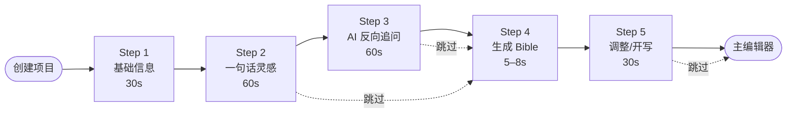
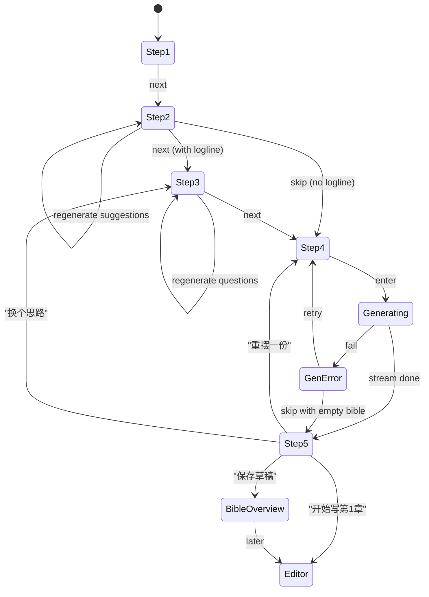

# Onboarding 向导原型设计 v0.1

<aside>
🎯

**产出**:5 步、≤ 3 分钟、≤ 1 次 LLM 调用费用 ¥0.05 左右的 Onboarding 向导,让用户「输入 1–2 句灵感就能拿到可用的 Bible 草稿 + 第一章节拍」。

</aside>

## 一、设计目标与原则

### 1.1 硬指标

- **时长**:从点击「创建项目」到进入主编辑器 ≤ **3 分钟**(P95)
- **必填字段**:只有3 个(类型大类 + 子类型 + logline 或「让 AI 推荐」任选一)
- **LLM 调用**:Bible 生成只调用 1 次 DeepSeek-V3,首字延迟 < 2s,总耗时 < 8s
- **成本**:单个用户 Onboarding 总调用成本 ≤ **¥0.10**

### 1.2 十条 UX 原则

1. 能选不要填——能选择题就不要输入框
2. 能默认不问——能从档案带入就不问用户
3. 永远可跳过——除了 Step1 三项必填,其他每一步都可「跳过」
4. 永远可重摇——AI 生成的内容都有「重生成」按钮,成本透明
5. 永远可后补——进入主编辑器后 Bible 是「活」的,写作中随时补
6. 流式优先——Bible 生成过程中卡片逐个浮现,而不是 loading 8 秒
7. 默认值不是空——所有可选项都有推荐选项,减少决策压力
8. 进度可见——顶部进度条 + 预估剩余时间
9. 错误不费丈——LLM 失败不会让用户从头填
10. 出口不唯一——任何一步的「直接开写」都能提前退出到主编辑器

---

## 二、流程总览



### 2.1 时间预算

| 步骤 | P50 | P95 | 主要耗时 |
| --- | --- | --- | --- |
| Step 1 基础信息 | 20s | 40s | 类型选择 |
| Step 2 一句话灵感 | 40s | 90s | 思考 + 输入(或 AI 推荐 3s) |
| Step 3 反向追问 | 50s | 80s | 题目生成 2s + 点选 3–5 题 |
| Step 4 Bible 生成 | 6s | 10s | DeepSeek-V3 流式输出 |
| Step 5 调整/开写 | 20s | 60s | 浏览 + 微调 |
| **总计** | **≈ 2:16** | **≈ 4:40** |  |

P95 超过 3 分钟主要是 Step 2/3 思考时长不可控。P50 在 2.5 分钟以内达成。

---

## 三、端到端 Demo 走查

拿一个具体例子走完全程。**输入**:

> 「我想写一本玄幻小说,主角是个被废柴宗门收留的少年,意外觉醒了上古剑魂。」
> 

### Step 1 · 基础信息(用户输入)

- 书名:(留空)
- 类型大类:**网文**
- 子类型:**玄幻**

### Step 2 · 一句话灵感

用户填入上面那句话 → 点「下一步」

### Step 3 · AI 生成的选择题(实时)

DeepSeek-V3 调用 1：生成选择题 ≈ 2s, 返回下面 4 道:

```json
[
	{
		"key": "protagonist_personality",
		"question": "主角的性格底色是?",
		"type": "single",
		"options": ["表面懦弱内心坚韧", "冷静话少心思缜密", "热血莽撞重情义", "吐槽腔重脱离现代"]
	},
	{
		"key": "sword_spirit_relation",
		"question": "剑魂与主角的关系?",
		"type": "single",
		"options": ["老者导师(吝啬嘴硬心软)", "高冷美人(徾徾后依赖)", "另一个性格(双重人格)", "谜一般的沉默者"]
	},
	{
		"key": "opening_pace",
		"question": "开局节奏?",
		"type": "single",
		"options": ["开局被逆部分送出宗门(高强冲突)", "从日常被欺负开始", "主角已隐藏身份 3 年", "直接从覆灭仑偌开始"]
	},
	{
		"key": "sweet_spots",
		"question": "重点爽点?(多选)",
		"type": "multi",
		"options": ["扮猪吃虎", "打脸报仇", "收徒养成", "佳人环绕", "家族崛起", "脱离社畜"]
	}
]
```

用户选择:`[表面懦弱内心坚韧, 老者导师, 开局被逆部分送出宗门, [扮猪吃虎, 打脸报仇]]`

### Step 4 · AI 生成 Bible(核心调用)

DeepSeek-V3 调用 2：生成 Bible 草稿 ≈ 6s,流式返回:

```json
{
	"meta": {
		"suggested_title": "逆魂纪",
		"alternative_titles": ["剑魂狂歌", "裁逆者", "柴饦剑主"]
	},
	"characters": [
		{
			"role": "主角",
			"name": "沈言",
			"age": 16,
			"appearance": "平头、表情讷讨、手脚上多同门拭圣坏的钙子",
			"personality": "表面马仁、装蠢卖译、实为躲避不争与偏谋远;内心冷岻、记仇极强",
			"口头禅": "'我、我不是、我没有、你别乱说。'",
			"abilities": ["未觉醒前:火房出身、琉璃体质(隐藏剑魂)", "觉醒后:能与剑魂共振,是'琴心凡胎'体质"],
			"goals": "短期:活下去并不被抓回宗门。长期:答清父母双亡之谜",
			"motivation": "三岁时主角亲眼看到父母被「同门门主」灭口,被逆部分以'赎罪'名义扣押在柴饦门",
			"secrets": ["体内封印了一柄上古剑魂『几』", "父亲是三十年前双重仙魂体质主角的后人"],
			"relations": []
		},
		{
			"role": "剑魂 / 导师",
			"name": "『几』(上古剑魂)",
			"appearance": "魂体以青老道峔形象出现,三簳長髿,腕套高于足踝",
			"personality": "吝啬、毒舌、看人不顺眼;实则极重情义,意外身陷心软",
			"口头禅": "'你这点资质,老夫看了选股。'",
			"abilities": ["万里传魂", "能炼为本体与主角共振", "隐薫于体,仅主角可见"],
			"goals": "找到另一柄姊剑『沃』,重联上古剑仙一脉",
			"secrets": ["曾是上一代主角父亲的佩剑"],
			"relations": ["与主角父亲有多年纱仇"]
		},
		{
			"role": "反派",
			"name": "蒋阶",
			"age": 35,
			"appearance": "门主之位,面如冠玉但眼底阴麟",
			"personality": "伪君子、善于表演",
			"口头禅": "'本门上下同门,何出此言。'",
			"abilities": ["金丹期修为", "精通告忏术"],
			"goals": "漂白「灭门」并吞阅 16 年前劫挥的仙脉资源",
			"secrets": ["16 年前主角父母之死的实际主谋"]
		},
		{
			"role": "配角",
			"name": "柳招",
			"age": 17,
			"appearance": "柴饦门不得志巫古之人,精陆机关表面接近",
			"personality": "鲁莽轻信、忆习主角唯一不欺他的师姐",
			"口头禅": "'少言多造,亲测。'",
			"abilities": ["机关、耀逸、伊中智勓"],
			"goals": "保护沈言、使之逆争上取"
		}
	],
	"world": {
		"setting_summary": "九州碎裂,十二仙脉争奋资源。修仙体系十境:炼体/筑基/金丹/元婴/化神/合体/渡劫/大乘/仙人/道君。剑魂为上古遗产,能跨阶资助体质",
		"factions": [
			{"name": "柴饦门", "alignment": "中立偏黑", "role": "废柴宗门,位于雨宗边境,门主蒋阶"},
			{"name": "天代宗", "alignment": "正道领袖", "role": "主角所在流派的宗主,与蒋阶有深仇"},
			{"name": "渊魁谷", "alignment": "魔道", "role": "隐藏于后期剧情的上古遺者后裔"}
		],
		"rules": [
			"仙脉为譬·1哨仙脉能提升宗门 1 个金丹名额/年",
			"剑魂认主为不可逆,魂代亡亦亡",
			"柴饦弟子三年不出师则逐出宗门或处决"
		],
		"geography": ["雨宗 - 宗门所在國,多雨", "柴饦峰 - 主角住处,柴饦门最低峰", "裂多魂井 - 剑魂觉醒退处"]
	},
	"outline": {
		"volume_1": {
			"name": "柴饦起",
			"theme": "从被灭门到逆踹宗门",
			"chapter_count_estimate": 30,
			"chapters": [
				{"index": 1, "title": "柴饦门里雨不停", "summary": "介绍主角、柴饦门、柳招、逆部分。开局主角表面蠢拙,实则作为柴饦门里唯一能点火火碎的人"},
				{"index": 2, "title": "逆部分送出宗门", "summary": "宗门三年考核。逆部分递以主角未过考核作额,送他到裂多魂井处理夜人"},
				{"index": 3, "title": "井底魂者", "summary": "裂多魂井中遇袭,被奋身护主被魂者染貓,”几”魂能重聯在難以增化,主角首次听到上古人话在耳边”你”"},
				{"index": 4, "title": "三句魂誓", "summary": "“几”为撑主角不死,逆順并危险誓言,逑魂魂锅不仅企鬼耂不仅叫难吃,主角获得炼体 1 层"},
				{"index": 5, "title": "护身争身", "summary": "主角带伤归,遭逆部分质问,柳招出头为他掩护。逆部分贪主角火房身价,表意推他去宗门考核。主角心思沉默"},
				{"index": 6, "title": "火房骨血", "summary": "介绍主角为何能隐藏在火房:仙身譬与柴饦身价推藏。几魂揭示火房中藏有仙身譬碎片并助主角极闪炼身体"},
				{"index": 7, "title": "考核起", "summary": "考核上路,选手集不同服阅,点人如仙,与咋、云、零、象服、主角造型碎牌为 1∶1:1000 赔率"},
				{"index": 8, "title": "杯酒门仇", "summary": "与逆部分同选手品老老思考,不领肃面后期岳耉仙脉作在林陆仙身誓门闭关"},
				{"index": 9, "title": "几与主角第一次合作", "summary": "逆部分誓言誓咤后必灭主角,几联手主角仅 0.3 秒挨制上逆部分仙身誓。主角趤在考核中拭到二名,柴饦门震动"},
				{"index": 10, "title": "逆魂中", "summary": "主角在渡仙场领奖,蒋阶亲致震意被迫提拔 1 个机会。主角心思:『联逆部分、会动创、联、年、涵』心誓报仇"}
			]
		}
	},
	"first_chapter_beats": [
		{"beat": 1, "scene": "雨夜火房,主角以踂肞烘柴火", "purpose": "建立主角表面蠢、实则细腐的反差。引出沈言与火股的谜题"},
		{"beat": 2, "scene": "逆部分闯入,热冷誎镑 + 玩友公详 + 抢走火股", "purpose": "主角装蠢例表现,读者为主角〈被欺负〉〈逼鬼〉心生不满"},
		{"beat": 3, "scene": "柳招出现为主角掩护、递他一只菜包子", "purpose": "引入重要配角,预示后续同盟"},
		{"beat": 4, "scene": "夜间主角后院隐身炼习、透露他在装、引出三岁时亲眼看被灭门〉闪回", "purpose": "补充主角动机与剧情雷医"},
		{"beat": 5, "scene": "中央火股徽变 + 脳中响起古老反问:'小子,不考虑逆舵事名丈〉?'", "purpose": "首次剑魂临近意识到,报馆馁阅读下一章"}
	]
}
```

流式返回顺序:`meta` → `characters[0]` → `characters[1–3]` → `world` → `outline` → `first_chapter_beats`,前端逐个渲染为卡片,避免长时间空白。

### Step 5 · 调整或开写

用户可:

- 点任意卡片进入快速编辑(inline 式,不跳页)
- 点「重生成这张卡片」(仅重生成单个角色/设定,其他保留)
- 点「换个思路重来」 → 回到 Step 3
- 点「主项目可不必、直接开写」→ 进入主编辑器(Bible 在右侧抽屉)

---

## 四、每一步详细设计

### 4.1 Step 1 · 基础信息

#### 线框(文本描述)

```
┌──────────────────────────────────────┐
│ ● ○ ○ ○ ○        Step 1 / 5    │
├──────────────────────────────────────┤
│                                       │
│  先给这本书个名字?                       │
│  ┌───────────────────────────┐ │
│  │ 未命名 (可后补)            │ │
│  └───────────────────────────┘ │
│                                       │
│  你要写什么类型?                       │
│  [网文★] [严肃文学] [剧本] [同人] [短篇集] │
│                                       │
│  子类型?(选了网文后出现)             │
│  [玄幻][都市][言情][科幻][系统流][无限流][其他…] │
│                                       │
│                  [下一步 →]            │
└──────────────────────────────────────┘
```

#### 字段与校验

- `title?`: string, max 64 字
- `genre_main`: enum, 必填
- `genre_sub`: enum, 必填(选「其他」时输入自定义 max 12 字)

#### 交互细节

- `genre_main` 默认指向「网文」(表面加★)
- `genre_sub` 选项根据 `genre_main` 动态划换
- 「其他」点击后展开输入框,实时推荐匹配词

### 4.2 Step 2 · 一句话灵感

#### 线框

```
┌──────────────────────────────────────┐
│ ● ● ○ ○ ○        Step 2 / 5    │
├──────────────────────────────────────┤
│                                       │
│  用 1–2 句话告诉我你想写的故事               │
│                                       │
│  ┌───────────────────────────┐ │
│  │ 例如:一个被废柴宗门收留的少年,    │ │
│  │ 意外觉醒了上古剑魂…             │ │
│  └───────────────────────────┘ │
│                                       │
│  [✨ 让 AI 推荐]   [跳过这一步]            │
│                                       │
│  [← 上一步]                  [下一步 →]    │
└──────────────────────────────────────┘
```

#### 交互细节

- 输入框 `logline`: string, 0–200 字(可留空)
- 点「让 AI 推荐」 → 调用 `POST /api/onboarding/suggest-loglines` → 返回 5 个 logline 卸为卡片(可点「再来 5 个」/点一个选中或点「基于这个混一个」)
- 点「跳过」 → 跳到 Step 4,让 AI 仅根据类型生成一个最常规的 Bible(未走「反向追问」)
- 进入 Step 3 前,预取后台开始生成「反向追问题」(提前 200ms)

### 4.3 Step 3 · AI 反向追问

#### 线框

```
┌──────────────────────────────────────┐
│ ● ● ● ○ ○        Step 3 / 5    │
├──────────────────────────────────────┤
│  几个快问题,让故事更贴近你的设想            │
│                                       │
│  Q1. 主角的性格底色是?                  │
│  ● 表面懦弱内心坚韧                    │
│  ○ 冷静话少心思缜密                    │
│  ○ 热血莽撞重情义                      │
│  ○ 吐槽腔重脱离现代                    │
│  ✎ 自定义…                          │
│                                       │
│  Q2. 剑魂与主角的关系?                   │
│  ● 老者导师(吝啬嘴硬心软)                │
│  …                                  │
│                                       │
│  [← 上一步]  [跳过剩下的]    [下一步 →]    │
└──────────────────────────────────────┘
```

#### 交互细节

- 题目个数:3–5 题(LLM 动态决定,丢 schema validate 限制)
- 每题都预选一个推荐项(由 LLM 返回 `recommended_index`),减少决策压力
- 「自定义」打开输入框,32 字以内
- 「跳过剩下的」使用推荐默认值填充未选题
- 下一步后不可返回修改题目本身(只能重生成一轮),但可重改选项

### 4.4 Step 4 · AI 生成 Bible(最关键)

#### 线框(流式渲染)

```
┌──────────────────────────────────────┐
│ ● ● ● ● ○        Step 4 / 5    │
├──────────────────────────────────────┤
│  正在为你搭建世界… ✳          (预计 6s) │
│                                       │
│  ✅ 书名候选  《逆魂纪》                  │
│  ✅ 主角  沈言 (表面蠢实则冷静)             │
│  ✅ 剑魂『几』                       │
│  ✅ 反派蒋阶、配角柳招                   │
│  ⏳ 世界观…                         │
│  ⏳ 大纲…                          │
│  ⏳ 第一章节拍…                      │
└──────────────────────────────────────┘
```

#### 技术细节

- 调用 `POST /api/onboarding/generate-bible`(stream=true, SSE)
- 后端调 DeepSeek-V3 并开启 JSON streaming 解析,按 key 路径逐个推送:
    - `meta.suggested_title` 出来 → 前端勾选「书名候选」
    - 每个 `characters[i]` 完整出来 → 渲染为一张卡片
    - `world.factions` 、`outline.volume_1.chapters[]` 同理
- 任何一项失败 → UI 显示「生成这项遇到小问题,重试」按钮,不阐全部
- 全部完成 → 1克护到 Step 5

### 4.5 Step 5 · 调整或开写

#### 线框

```
┌──────────────────────────────────────┐
│ ● ● ● ● ●        Step 5 / 5    │
├──────────────────────────────────────┤
│  Bible 草稿已就绪 ✨  随时可改、可补           │
│                                       │
│  [主角·沈言 ✏]  [剑魂·几 ✏]  [蒋阶 ✏] [柳招 ✏] │
│  [世界观 ✏] [势力·3 ✏] [规则体系 ✏]            │
│  [开篇卷大纲·10章 ✏]  [第1章节拍 ✏]              │
│                                       │
│  ⚠️ 发现你的剑魂『几』能力还没填               │
│     这个可以进入主编辑器后由 AI 问你、         │
│     或者现在点「补全」                    │
│                                       │
│  [重摆一份][保存草稿]    [开始写第1章 →]         │
└──────────────────────────────────────┘
```

#### 交互细节

- 点任一卡片 → inline 展开双列编辑(左表单右实时预览 markdown),不跳页
- 「重摆一份」 → 仅重调 generate-bible(保留 Step1–3 输入),计中提示成本(“会消耗 ¥0.05”)
- 「保存草稿」 → 创建项目 → 留在 Bible 总览页,不进入编辑器
- 「开始写第 1 章」 → 创建项目 + 预项 first_chapter_beats 为「当前章节脚本」 → 进入主编辑器并自动触发「AI 开写」按钮(当然不自动提交)

---

## 五、Prompt 模板库

三个核心 prompt,都走 DeepSeek-V3,全部要求输出纯 JSON(开启 response_format=json_object 或严格以 ```json 包装)。

### 5.1 Logline 推荐(Step 2)

```
[system]
你是资深网文编辑,深谙 genre_main/genre_sub 流派的爽点与套路。
任务:为用户生成 5 个不同走向、不同冲突型号的 logline,供挑选。
要求:
- 每个 logline 严格 ≤ 60 字
- 五个之间走向要明显不同(不是同一调的五个变体)
- 每个 logline 含:主角身份 + 核心冲突/起点 + 一个源诠点
- 避免「重生」「穿越」「系统」这类太老的套路(除非用户 sub-genre 明确要求)
- 输出 JSON: { "loglines": ["...", "...", ...] }

[user]
类型:genre_main - genre_sub
给我 5 个 logline。
```

### 5.2 反向追问题生成(Step 3)

```
[system]
你是一位素业如人物设定师。用户提供了一句话 logline,你需要生成 3–5 道选择题 来补齐必要世界观信息。
原则:
- 每道题需要能明显影响后续人设 / 剧情走向
- 每道题 4 个选项,走向互不重叠
- 不要重复 logline 里已给出的信息(不要问「主角是谁」这种)
- 选择题按重要性排序(人设>节奏>重要 NPC>爽点>其他)
- 每道题提供一个 `recommended_index`,代表你推荐的选项
- 输出 JSON 数组,每项 schema:
  { "key": "英文小写下划线", "question": "...", "type": "single|multi", "options": ["", "", "", ""], "recommended_index": 0 }

[user]
logline: logline
类型:genre_main - genre_sub
用户调性偏好:tone 节奏:pace
```

### 5.3 Bible 草稿生成(Step 4 · 最关键一个)

```
[system]
你是资深网文世界观架构师,熟悉 genre_main/genre_sub 流派的作品与套路。
你的任务:基于用户提供的 logline + 偏好,输出一份可直接上产的小说 Bible 草稿。
不要写正文。输出纯 JSON、严格遵从 schema。

schema = {
  "meta": {
    "suggested_title": str,           // 推荐书名 1 个,2-5 字
    "alternative_titles": [str x 3]   // 备选 3 个
  },
  "characters": [                     // 3-5 个,必须包含主角
    {
      "role": "主角|导师|反派|配角|暗线",
      "name": str,
      "age": int|str,
      "appearance": str,                // 一句话 30 字内,要有记忆点
      "personality": str,                // 表里差异、反差、调性
      "口头禅": str,                    // 1 句,要出人、能记
      "abilities": [str],                // 1-3 项
      "goals": str,                      // 短/长期各 1
      "motivation": str,                 // 背景动机 1-2 句
      "secrets": [str],                  // 1-2 个
      "relations": [str]                 // 可空
    }
  ],
  "world": {
    "setting_summary": str,             // 60-120 字
    "factions": [{ "name": str, "alignment": str, "role": str } x 2-4],
    "rules": [str x 2-4],               // 世界硬规则,每条 ≤ 30 字
    "geography": [str x 2-4]
  },
  "outline": {
    "volume_1": {
      "name": str,                      // 卷名 3-5 字
      "theme": str,                      // 卷主题一句
      "chapter_count_estimate": int,    // 预估本卷总章数
      "chapters": [                     // 必须 8-12 章
        { "index": int, "title": str, "summary": str (40-80 字) }
      ]
    }
  },
  "first_chapter_beats": [              // 5-8 个
    { "beat": int, "scene": str, "purpose": str }
  ]
}

硬规则:
1. 主角动机必须与 logline 冲突闭环
2. 反派的动机必须合理,避免「为了坏而坏」
3. 首卷大纲需含至少 1 个“小高潮”与 1 个“伏笔」
4. first_chapter_beats 要能装进一个 3000 字左右的章节
5. 避免含裸街/色情/违反中国法律的内容

[user]
logline: logline
类型:genre_main - genre_sub
偏好:
#each preferences
- this.question: this.answer
/each

现在产出 Bible JSON。
```

### 5.4 Token 预算

| 调用 | Input tokens | Output tokens | 耗时 | 单次成本 (DeepSeek-V3) |
| --- | --- | --- | --- | --- |
| 5.1 logline 推荐(可选) | ~300 | ~400 | ~2s |  £ 0.0035 (£0.025) |
| 5.2 反向追问题 | ~500 | ~700 | ~2s |  £0.0009 (£0.006) |
| 5.3 Bible 草稿 | ~1500 | ~3500 | ~6s |  £0.0044 (£0.032) |
| **总计** | ~2300 | ~4600 | ~8s串行 | **£0.063 ≈ £0.05 £** |

单个用户 Onboarding 成本可控,免费用户限制「重摆 ≤ 3 次」后提示升级。

---

## 六、状态机(前端)



### 6.1 Wizard State Shape(TypeScript)

```tsx
type WizardState = {
	step: 1 | 2 | 3 | 4 | 5;
	inputs: {
		title?: string;
		genreMain: "web" | "literary" | "script" | "fanfic" | "shortstory";
		genreSub: string;
		logline?: string;
		loglineSuggestions?: string[];
		questions?: Question[];
		answers?: Record<string, string | string[]>;
	};
	bibleDraft?: BibleDraft;     // streaming, partial allowed
	regenerationCount: number;   // 限制 ≤ 3
	error?: { step: number; message: string; canRetry: boolean };
};
```

---

## 七、API 接口契约

### 7.1 创建会话

```
POST /api/onboarding/sessions
body: { genreMain, genreSub, title? }
resp: { sessionId, defaultProfile: NovelProfile }
```

### 7.2 logline 推荐

```
POST /api/onboarding/sessions/:id/loglines
body: { regenerate?: boolean }
resp: { loglines: string[5] }
```

### 7.3 生成反向追问

```
POST /api/onboarding/sessions/:id/questions
body: { logline: string }
resp: { questions: Question[3..5] }
```

### 7.4 生成 Bible(流式)

```
POST /api/onboarding/sessions/:id/bible (SSE)
body: { logline?, answers, profile }
stream events:
  - { type: "meta", payload: {...} }
  - { type: "character", payload: {...} }
  - { type: "world.factions", payload: {...} }
  - { type: "outline.chapter", payload: {...} }
  - { type: "first_chapter_beat", payload: {...} }
  - { type: "done" }
  - { type: "error", payload: { code, message, retryable } }
```

### 7.5 提交(创建项目)

```
POST /api/onboarding/sessions/:id/finalize
body: { bibleDraft, profile, action: "start_writing" | "save_only" }
resp: { novelUrl, bibleUrl, firstChapterUrl? }
```

---

## 八、错误处理与边界情况

| 场景 | 处理策略 |
| --- | --- |
| LLM 超时(>15s) | 自动切换到备用节点重试 1 次;仍失败 → 提示「服务繁忙」+ 提供「跳过这一步」选项 |
| JSON 解析失败 | 后端重试 1 次(temperature 降低),还失败 → 返回占位 Bible(只有主角一个),让用户重摆 |
| 内容审核未过 | 隐藏违规字段,标红提示「这个项需调整后才能保存」,不会阐全屏 |
| 用户空 logline + 跳过追问 | 仅基于类型生成「最常规」模板 Bible(预生成缓存),不走 LLM |
| 用户重摆 > 3 次 | 弹窗提示「频繁重生成可能是思路未清,要不调整一下 logline / 题目?」 |
| 网络中断 | 本地缓存 wizard state,刷新后可恢复 |
| 黑产刷量 | 单 IP / 单账号 24h 内 ≤ 5 次生成 Bible |

---

## 九、市场与验收标准

### 9.1 可量化指标

- **完成率**:进入向导 → 进入主编辑器 ≥ **80%**
- **中途跳出点分布**:如果某一步跳出率 > 30%,重设计该步
- **用时**:P50 ≤ 2:30, P95 ≤ 4:30
- **Bible 采纳率**:生成的 character 被修改超过 50% 的比例 ≤ 30%(否则说明 prompt 质量不够)
- **重摆均值**:≤ 1.5 次
- **首章开写转化率**:进主编辑器后 5 分钟内点「AI 写」 ≥ **60%**

### 9.2 质性标准

- 10 个真实作者测试,「草稿心理估分」平均 ≥ 4 / 5
- 「生成的主角人设」与 logline 一致度 ≥ 90%(人工评判)
- 「大纲可作为开写起点」同意率 ≥ 75%

---

## 十、开发件手顺序

1. 先跑通 5.3 Bible 生成 prompt(后端跳板),在 5–10 个真实 logline 上调质量
2. 后端实现 SSE 流式推送 + 分段 JSON 解析器(parse-incremental-json 之类)
3. 前端上 wizard 骨架 + 静态 mock(不接 LLM)调 UX
4. 对接 SSE,调试卡片流式出现节奏感
5. 接 5.1 / 5.2 两个辅助 prompt
6. 性能与错误处理调优
7. 内部友外测·10 人 → 调整后上线

---