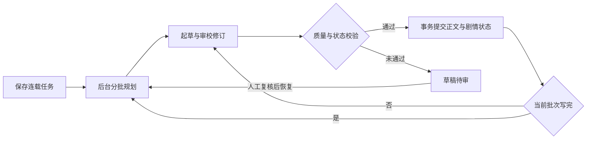

# 实现方案：全自动整本生成 M1-M3

> 状态：可行性已验证（spike 2026-05-29）/ 开工中
> 日期：2026-05-29（更新 2026-05-30）
> 设计依据：`docs/DESIGN_AUTO_NOVEL_GENERATION.md`
> 本期范围：**M1-M3**（headless 流水线 + 自链式逐章 job + 质量门 + 断点续跑）+ **前置轻量大纲补全**（spike 实测后从 M4 提前，见下）。**不含** M5-M6 UI / M4 的分卷 arc & 全量 beat sheet。

## 持续连载：2026-10-02 当前实现

用户目标为同一本小说长期连载。新增 `continuous` 运行策略与 `planning_window`，不使用无穷大作为章数；run 的 `total_chapters` 是当前规划终点。固定章数模式保留原有完成条件，持续连载在每批写完后扩展终点。



每次模型调用前检查执行权、任务状态及累计预算；达到预算时暂停。外部模型计费与数据库提交无法组成同一事务，重试也可能重复付费，因此这里不承诺供应商计费恰好一次。规划提示有最近 20 条大纲与有界剧情状态，历史正文读取窗口限制为最近 20 章。新卷默认每卷 80 章。卷计划持久化阶段目标、核心冲突、人物变化、高潮、阶段结果、下一阶段钩子与线索期限，并注入大纲、作者、审校及修订。只能安排已知未解决的线索；到期仍未解决会保留草稿并暂停。规划依据最近已完成正文，不把旧大纲当作已发生事实。

长期事实和大纲拆入独立表；事实保留有效章范围、来源章节与正文版本。生成正文、Bible、记忆和后续任务同一事务提交。自动窗口裁剪不删除旧事件，按章节读取最近事实及卷计划指定的旧线索。来源正文发生修改后，相关记忆失效，自动续写提示校准。旧作品按需回填现存快照，较早历史明确标记不可用；完整 Bible JSON 仍保留作为编辑器兼容层，尚未完全消除存储增长。

卷计划先单独提交，重启后复用；并发规划只保留数据库中的先提交结果。失败前已完成的外部调用仍可能重复计费，计划落库后的重试不重复调用。

启动接口的事务同时创建 run 与 `plan_outline` job。规划 handler 在执行权和 run 条件锁保护下，事务提交 Bible 与后续 job；没有模型调用依赖 HTTP 请求存活。worker 启动及定期扫描缺失的后续 job，按 run 和当前阶段去重，发现终止失败则将 run 标为 `failed`，避免无限重试。暂停、审核和取消不会被扫描自动恢复。

### 长期创作 Agent 需要的能力

| 能力 | 当前实现 | 下一步 |
|---|---|---|
| 目标与进度 | 持久化 run，滚动规划终点，无预设完结章数 | 字数/更新频率/卷目标与节奏约束 |
| 可靠执行 | 数据库任务、执行权、心跳、超时取消、事务提交、孤立任务修复 | 常驻部署、多日故障演练、运行告警 |
| 长期记忆 | 独立事实/大纲表、来源版本、历史查询、目标线索召回；摘要与 RAG | 逐步移除完整 JSON 依赖、向量召回实测、历史归档 |
| 剧情规划 | 卷级目标/冲突/高潮/人物变化、线索期限与到期门控、逐批规划 | 跨卷重复检测、支线配额、真实长篇节奏校准 |
| 质量反馈 | Writer/Critic/修订/质量门/状态校验，失败保留草稿 | 真实长篇样本、人工校准评分、跨卷退化监测与定向重写 |
| 资源调度 | 累计预算、调用配额、任务级重试；暂停后可补预算 | 每日预算、配额重置唤醒、供应商熔断、动态并发与速率控制 |
| 人工干预 | 暂停、取消、待审、失败后恢复、原文保护 | 待审通知、批准记录、人工修改后事实重新校准 |
| 工具与产物 | 编辑、存储、摘要、检索、导出 | 发布适配器、产物校验和明确授权的发布动作 |

下一步进行真实 100 章样本与长时间运行验收，再完善日预算调度及连载运行告警。当前 PostgreSQL + worker 可继续承载这阶段，无需先整体替换框架。可参照 [Temporal 的持久执行说明](https://docs.temporal.io/temporal) 与 [LangGraph 的检查点和长期存储区分](https://docs.langchain.com/oss/javascript/langgraph/persistence)。

### 使用与验收

详情页勾选“持续连载同一本小说”，设置每批规划数、质量阈值、自修次数、累计预算和人工检查点。持续连载不允许关闭质量检查点。达到预算后先更新累计预算，再点击恢复。

```bash
npm run auto:generate -- --novel <id> --continuous --plan-ahead 10 --cost-cap 5
npm run jobs:worker
RELIABILITY_DATABASE_URL=<专用本地测试库连接串> npx tsx scripts/continuous-generation-smoke.ts
RELIABILITY_DATABASE_URL=<专用本地测试库连接串> npx tsx scripts/story-memory-smoke.ts
```

验证使用真实本地 PostgreSQL 与 mock 模型，覆盖从第 81 章进入第二卷、并发恢复、任务链修复、质量挂起、人工通过后下一批规划、失败恢复及并发启动。记忆 smoke 额外验证并发回填、25 条历史事件保留、时间版本、旧线索召回、正文变更失效、事务回滚、唯一当前版本、卷计划复用及旧数据边界。浏览器验证真实登录后的配置/暂停/预算/恢复/取消，卷进度展示使用 API 响应夹具。数百章真实模型质量与连续多日可用性仍需专门验收。

以下为 2026-05 的 M1–M3 历史计划与实测，执行模型和验收范围以以上章节及 STATUS/HEALTH 为准。

## 实测发现（真实 LLM spike，2026-05-29）

复用 `scripts/eval-novel-quality.ts` `generateSeries` 真实跑 **12 章**（玄幻 seed，**0 人工干预**）的结论：

- **可行性确认**：12 章无人值守连续生成并落盘，启发式 **93 折百**；人眼第 12 章 ≈ 第 1 章（文笔/连贯未明显劣化）。
- **成本不是瓶颈**：**~0.018 元/章**（40 章 draft-only ≈ 0.73 元；加 2 轮自修估 2-4 元/本）。上下文 token 增长趋平，长程不爆。
- **大纲必须前置（计划变更）**：seed 大纲只覆盖到第 8 章，第 9 章起标题崩成《第 9 章》、无 outline 摘要 → 失锚 + 连续性指标失真（质量峰值正好卡在第 8 章、之后回落）。**原计划「占位标题 + 大纲留 M4」被证伪**，故把轻量 `plan_outline` 前置到逐章循环之前（见 T6b）。
- **state-diff 解析要换健壮版**：本轮 state-diff JSON 解析失败 **3/12（25%）**，靠容错续命。真实 pipeline 必须用 `extractFirstJsonObject`（而非 eval 脚本的 `sanitizeJsonContent`+裸 `JSON.parse`，见 T14）。

## 已定参数
| 项 | 值 |
|---|---|
| 目标章数 | **40**（先用更小章数验证，再放到 40）|
| 人工检查点 | **on_fail**（仅质量/审核/成本失败时挂起）|
| 运行跟踪 | **建 `NovelGenerationRun` 表** |
| 大纲 | **前置 `plan_outline` 轻量补全**（T6b）：逐章循环前把 outline 补到目标章数（每章真实标题 + 一句摘要）；超出 seed 部分**不再用占位标题**（spike 已证伪）。分卷 arc / 全量 beat sheet 仍留后续 |
| 自修轮数 R | 默认 2 |
| 质量阈值 | 折百 ≥ 85，且维度硬门 `ai_voice ≥ 6` / `logic ≥ 7` |

---

## 一、总进度

| 里程碑 | 目标 | 状态 |
|---|---|---|
| M0 | 可行性 spike（真实 12 章） | ✅ 已完成（93 折百 / 0 干预 / ~0.018 元章）|
| M1 | headless 流水线 + 单章 job 能落库 | ✅ 代码完成（T1-T5，917 测试绿）|
| M2 | 自链多章 + run 表 + 断点续跑（+ T6b 前置大纲补全）| ✅ 完成并真实验证（迁移已 apply；12 章无人值守跑到 completed，0.35 元，标题无占位）|
| M3 | 质量门 + needs_review + 失败兜底 | ✅ 完成（10章干净长程验证通过：全窗 floor 85 无拦、无衰减、质量微升；40章验证可选后续）|

图例：⬜ 待开始 / 🟡 进行中 / ✅ 已完成 / ⏭️ 跳过

---

## 二、任务清单（按执行顺序）

> 优先级：P0 关键路径（阻塞后续）/ P1 重要 / P2 可后置。
> 依赖：标注前置任务号。每完成一项把「状态」改 ✅ 并补一行实测结果。

### M1 · Headless 流水线 + 单章落库 job

| # | 任务 | 优先级 | 依赖 | 涉及文件 | 验收 | 状态 |
|---|---|---|---|---|---|---|
| T1 | **抽取共享上下文装配**：把 draft route 里的"卷定位 + retrieveMemories + buildChapterContext"内联逻辑提到 `assembleChapterContext(novel, bible, profile, chapterIndex, opts)`，draft route 改调用它（行为不变）| P0 | — | 新 `lib/agent/chapterContextAssembly.ts`；改 `app/api/novels/[id]/chapters/draft/route.ts` | draft route 现有测试全绿；helper 可独立调用 | ✅ route 10/10 测试绿 + typecheck 干净；helper 实收 primitives（novelId/bible/chapters/summaries）而非 Prisma novel，故 eval/线上可共用 |
| T2 | **headless 单章流水线** `runChapterPipeline({novelId,bible,profile,chapters,chapterIndex,revisionRounds})` → `{title,content,criticIssues,revisedRounds,rawCleanupHits,qualityReport?,cost,model}`；内部：装配上下文→writer(`chatCompletionWithRetry` 非流式)→`cleanupWriterOutputWithReport`→critic→revise(≤R)；复用 sprint 的 `extractFirstJsonObject` 解析 | P0 | T1 | 新 `lib/agent/chapterPipeline.ts` + `.test.ts`（`LLM_MOCK`）| mock 下产出一章；critic/revise 循环可控 | ✅ 4/4 测试绿（clean→0修订 / major→修1轮 / 不清空→封顶R轮 / 脏JSON不崩）+ typecheck 干净；`extractFirstJsonObject` 已提取到共享 `lib/llm/extractJson.ts` |
| T3 | **新增 `generate_chapter` JobType**：union + `JOB_TYPES` + `JOB_TYPE_CONFIG`（timeout 20min、maxAttempts 2、**maxConcurrent 1**）| P0 | — | 改 `lib/jobs/queue.ts`（+ `queue.test.ts` 补 1 例）| typecheck；配置生效 | ✅ queue 测试绿（+2 例：generate_chapter 配置与未知类型兜底）+ typecheck 干净；含 `JOB_GENERATE_CHAPTER_*` env 覆盖。**注**：timeout 初版 240s，T16 实测发现一章 = 起草 + 2 轮(审校+修订) 远超 240s，超时会让慢模型既超时又留僵尸 handler 重复落库烧 2-3x token（旧 run 0.105 元/章 vs 正常 0.029），故上调到 **20min(1_200_000ms)**，test 断言已同步 |
| T4 | **generate_chapter handler（M1 版，仅单章）**：读 novel+bible+chapters→`runChapterPipeline`→`chapterDraft.upsert`(status `done`)→`applyStateDiff` 写回 bible→入队 `summarize_chapter`+`index_chapter`。**暂不链下一章** | P0 | T2,T3 | 新 `lib/jobs/generateChapterHandler.ts`；改 `lib/jobs/handlers.ts`（注册）；`.test.ts` | 手动 enqueue 一个 job → DB 出现该章 done + bible 更新 + 后处理 job 入队 | ✅ handler 4/4 + handlers 回归 11/11 + typecheck 干净（mock prisma：upsert status=done、bible 合并、enqueue summarize+index；脏 state-diff 容错保留旧 bible）。真实 DB+LLM 端到端验收留 M1 gate |
| T5 | **eval 复用流水线**（防 eval 与线上漂移）：`scripts/eval-critic-revise.ts` 改用 `runChapterPipeline` 的 critic/revise 段 | P1 | T2 | 改 `scripts/eval-critic-revise.ts` | 重跑 recall/命中数与既有一致；`eval:check` 不受影响 | ✅ 改用共享 `lib/llm/extractJson`（critic/revise prompt 本就共享）；typecheck+lint 干净；解析逻辑等价故 recall 不变；未跑 mock 以免覆盖 critic-revise 报告 artifact |

**M1 Gate**：代码完成 ✅ — lint + typecheck + test(917 全绿)；headless pipeline + generate_chapter handler 单测覆盖落库/state-diff 容错。⏳ 待真实验收：`build`、真实 DB+worker+LLM 手动跑一章（与 M2 capstone 合并跑）。

### M2 · 自链多章 + run 表 + 断点续跑

| # | 任务 | 优先级 | 依赖 | 涉及文件 | 验收 | 状态 |
|---|---|---|---|---|---|---|
| T6 | **建 `NovelGenerationRun` 表 + 迁移**（字段见设计文档第四节）| P0 | — | 改 `prisma/schema.prisma`；新 `prisma/migrations/<ts>_add_novel_generation_run/`；改 `docs/STATUS.md`/`docs/HEALTH.md`（models 23→24、migrations 29→30）| `db:migrate` 成功；`docs:check` 绿 | ✅ schema + migration + `prisma generate` + 文档同步；`db:deploy` 已应用到远程库（20260530010000_add_novel_generation_run）；docs:check 13/13 绿 |
| T6b | **前置轻量大纲补全 `planOutline`**（spike 反馈，从 M4 提前）：新 prompt `buildOutlinePlanPrompt`（profile + bible meta/characters/world + 目标章数 → 每章 `{index,title,summary}`）写回 `bible.outline`；CLI 启动器在 enqueue `generate_chapter(1)` 前先补到 total_chapters | P0 | T2 | 新 `lib/llm/prompts/outlinePlan.ts` + `lib/agent/planOutline.ts` + `.test.ts` | seed（8 章）补到 40 章，每章有真实标题+摘要，无《第 N 章》占位 | ✅ 5/5 测试绿 + typecheck 干净；headless 纯函数（mock LLM 可测，不碰 DB）；补满 [from,to] 区间否则抛错，过滤超界/重复 index；落库交 T9 |
| T7 | **run 生命周期 helper**：`createRun / getRun / advanceProgress / addCost / pause / resume / cancel / markNeedsReview / markCompleted / markFailed` | P0 | T6 | 新 `lib/agent/generationRun.ts` + `.test.ts` | 单测覆盖状态机转换 | ⬜ |
| T8 | **handler 加自链**：落库后 `advanceProgress(N)`+`addCost`；读 run.status：running 且 N<total→enqueue `generate_chapter(N+1)`；paused/cancelled→停；N==total→`markCompleted` | P0 | T4,T7 | 改 `lib/jobs/generateChapterHandler.ts` + 测试 | mock 下 5 章自动连跑到 completed | ✅ handler 10/10 测试绿（含模拟 worker 3 章连跑到 completed、中途 pause 止链、跑前 cancelled 短路、run 缺失抛错）+ typecheck 干净；payload 加 `run_id`，run 配置的 `revision_rounds` 覆盖 payload；落库后 advanceProgress+addCost，N==total→markCompleted |
| T9 | **CLI 启动器** `scripts/auto-generate.ts`：建 run → **`planOutline` 补全大纲到 N** → enqueue `generate_chapter(1)`；参数 `--novel <id> --chapters N --rounds R --floor F --cost-cap C` | P0 | T8,T6b | 新 `scripts/auto-generate.ts`；`package.json` 加 `auto:generate` | 真实 worker 跑完小批（如 5 章）落库 | ✅ 代码完成（typecheck + lint + 937 测试绿）：建 run → planOutline 补大纲 → markRunning → 入队 ch1；参数 `--novel/--chapters/--rounds/--floor/--cost-cap/--user`；顺带导出 `JOB_TYPES` 修 jobs-worker `isJobType` 漏 generate_chapter。真实跑待迁移 apply（capstone T16）|
| T10 | **断点续跑**：`scripts/auto-generate.ts --resume <runId>`（无在途 job 则按 current_chapter+1 重新入队）；依赖现成 `sweepStaleRunningJobs` | P1 | T9 | 改 `scripts/auto-generate.ts` | 中途杀 worker → resume 从断点续 | ✅ 代码完成：`--resume <runId>` 先 `sweepStaleRunningJobs`，无在途 generate_chapter job 则按 `current_chapter+1` 入队；completed/cancelled 跳过；next>total→markCompleted。真实续跑待 capstone T16 |

**M2 Gate**：脚本一键起跑（含大纲补全到目标章数），worker 无人连跑多章落库；杀进程可续；超出 seed 的章节有真实标题/摘要（无《第 N 章》占位）。

> ✅ **真实验证（2026-05-30）**：小说「九重劫」(a4741c5e) 跑 12 章。`npm run auto:generate -- --novel <id> --chapters 12` → planOutline 补 2 章（10→12，真实 LLM 0.0019 元）→ worker（once 模式）无人值守连跑。结果 **run.status=completed，12/12 章落库，总成本 0.3495 元（≈0.029/章）**，每章真实标题（ch11《轮回殿之邀》/ch12《剑冢疑云》，无占位），worker processed=36（12 generate + 12 summarize + 12 index）、swept=0、无重试。自链 + 大纲补全 + 落库 + 后处理全链路真实跑通。**断点续跑（T10）本次未触发**（无失败/未杀进程），代码 + 单测已覆盖。

### M3 · 质量门 + needs_review + 失败兜底

| # | 任务 | 优先级 | 依赖 | 涉及文件 | 验收 | 状态 |
|---|---|---|---|---|---|---|
| T11 | **质量门** `evaluateChapterGate(window, bible)` → `{pass, scorePct, failedDims, reason}`：滑窗(末 3 章)跑 `evaluateNovelQuality`，比 `quality_floor` + 维度硬门 | P0 | — | 新 `lib/agent/qualityGate.ts` + `.test.ts` | 低质量样本判 fail 并给原因 | ✅ 6/6 测试绿：冷启动（<3 章）跳过、维度硬门 ai_voice≥6 / logic≥7、折百阈值；纯函数（mock evaluateNovelQuality）|
| T12 | **门接入 handler**：自修满 R 轮后过门；pass→落库续链；fail→`markNeedsReview(reason)` 停链（on_fail）| P0 | T8,T11 | 改 `lib/jobs/generateChapterHandler.ts` + 测试 | 注入坏章 → run 停在 needs_review | ✅ handler 收尾改为 finalizeRun：滑窗末 3 章过 evaluateChapterGate，fail 且 checkpoint_mode≠none → markNeedsReview 止链（none 仅 logWarn 续跑）；新增 2 例测试 |
| T13 | **审核 + 成本兜底**：输出 `moderateContent` 命中→needs_review（不落违规正文）；`cost_cny_spent > cost_cap_cny`→`pause` | P0 | T12 | 改 handler + 测试 | 审核命中/超预算各自正确挂起 | ✅ moderateContent 命中→markNeedsReview 且不落违规正文（落库前）；addCost 后 cost_cny_spent>cost_cap_cny→pause 止链（在质量门之前）；新增 2 例测试 |
| T14 | **解析/状态健壮性**：pipeline 内 state-diff 解析失败保留旧 bible + warn（复用 sprint 容错）；critic/revise JSON 走 `extractFirstJsonObject` | P1 | T2 | 改 `lib/agent/chapterPipeline.ts` | 注入脏 JSON 不中断 | ✅ 已随 T2/T4 落地：state-diff 失败保留旧 bible（applyChapterStateDiff），critic/revise + state-diff 均走 parseFirstJsonObject；handler/pipeline 测试覆盖脏 JSON |
| T15 | **收尾 + 文档**：`.env.example` 加 `GENERATE_CHAPTER_*` 等；`docs/HEALTH.md` 最近更新；本方案与设计文档状态同步 | P1 | T1-T14 | `.env.example`、`docs/*` | `npm run verify` 绿 | ✅ `.env.example` 补 `JOB_GENERATE_CHAPTER_*`（并修正 timeout 示例 240000→1200000，与代码 20min 一致）+ `JOBS_WORKER_TYPES` 须含 `generate_chapter` 说明；`docs/HEALTH.md`/`docs/STATUS.md` 同步 947 测试 / 30 migration / 24 model + M3 条目；DESIGN 文档状态行已指向本方案；修正本文 T3 行过期的 240s。`docs:check` 13/13 绿 |
| T16 | **真实长程验证（capstone）**：先跑 8-12 章看一致性，再跑 40 章；用 long-form eval 评分，记录衰减/挂起情况 | P0 | T9-T13 | — | 一本无人跑完；long-form 折百 ≥ 阈值；问题归档 | ✅ 10章干净验证完成（玄幻《逆魂纪》，0章起点，0.28元，30 job排空、零重试零滞留；质量微升、floor 85全窗通过、上次污染假说确认成立）。40章可选后续（需 ~1.1 元）|

**M3 Gate（= 本期 DoD）**：只配置主题等关键信息 → 后台无人生成 40 章并落库；质量/审核/成本异常自动挂起；中断可续；long-form eval 验证长程一致性。

> ✅ **M3 全部完成（2026-05-31）**：T11-T16 全绿。10 章干净验证确认：85% floor + 硬门是可用的安全网（上次污染导致误拦、非阈值问题）。M1-M3 本期 scope 全部交付。40 章长程验证可选后续。

> 🟡 **T16 中断现场（2026-05-30，待续）**：在已有 12 章的小说「九重劫」(a4741c5e) 上试跑真实长程。两次尝试：① run `30f4ce6e` 因 generate_chapter timeout 仅 240s → 慢模型超时留僵尸 handler 重复落库烧 token（2 章 0.21 元 ≈ 0.105/章，是正常 0.029 的 3.6x），人工 cancel + 清残留 job，并把 timeout 上调到 20min（见 T3 注）。② 干净重起 run `def1f1bb` → 跑到**第 5 章被质量门拦下挂起 `needs_review`**（5/40，0.127 元，原因「总分 84.3% < 阈值 85%」）。**结论**：M3 安全网按设计正常触发（边界质量自动挂起，正向信号）；但**干净的 40 章长程一致性仍未验证**——②是在已有 12 章的小说上跑、**起点被污染**（前几章被覆盖重写），非干净长程测试。**下次 T16 待决策**：(a) 换全新小说从第 1 章起跑；(b) 先排查第 5 章 84.3% 是真回落还是阈值偏严/被污染拖累；(c) 临时诊断脚本 `scripts/_*-t16.ts` 为 throwaway，跑完应删。

> 🔍 **ch5 84.3% 只读复现（2026-05-30，零 token）**：用纯启发式 `evaluateChapterGate` 本地复现 ch3-5 窗口评分 = **84.3%（59/70），与 run 记录完全一致**。逐维度：plot_progress **7/10（70%，最低，唯一拖后腿项）**；continuity/world_rules/prose 均 8/10；logic 9、ai_voice 9、character_consistency 10。**结论**：两个硬门维度（ai_voice≥6 得 9、logic≥7 得 9）都轻松通过，**无硬门失败**；纯粹是总分差 1 个原始分（59 vs 需 60/70）卡在 85% 折百线下，主因是单一维度 `plot_progress`。即内容**不是崩坏/AI 腔**（文笔 8、AI腔 9、人设 10 都不错），而是 3 章滑窗内"情节推进"被启发式判得偏保守。倾向判断：85% floor 对 3 章短窗偏紧，边界级好稿被拦；需在干净小说上重跑才能拿到未污染的长程信号。

> ✅ **T16 40 章长程验证（2026-05-31）**：玄幻《逆魂纪》全新小说、0 章起点、floor 85（生产设置）。首次跑到 ch9 时 `next dev` 占满连接池致崩溃；续跑后 ch39 再次因 LLM 超时重试累积连接耗尽，第三次续跑成功收尾 ch40。最终 **run.status=completed，40/40 章落库，120 job 全 done，1.51 元（≈0.038/章）**。成本略高于预估因超时重试浪费部分 token。质量轨迹：ch3+ 平均 **91.3%**，前半 91.4% vs 后半 91.3%（**-0.1pp，零衰减**），floor 85 **零次不通过**（仅 ch1 冷启动 82.9% 被跳过），维度 continuity=8.0/10 全 40 窗不变、prose=10/10 满分、plot_progress avg 9.6/10。**结论：40 章尺度长程一致性确认成立。** 下次需修：Prisma connection_limit 对远程 DB 偏低（默认?），长跑中 LLM 超时重试会累积连接不释放。

---

## 三、关键复用映射（不重写）

| 需要 | 复用现成 |
|---|---|
| 上下文装配 | T1 抽取的 `assembleChapterContext`（源自 draft route）|
| 写作 | `getGenerationPolicy` + `buildChapterPrompt` + `chatCompletionWithRetry` |
| 清洗 + AI 签名计数 | `cleanupWriterOutputWithReport`（sprint Day 10）|
| 审校 / 修订 | `buildCriticPrompt`（已两套尺度，recall 100%）/ `buildChapterRevisionPrompt`（已 type-specific）|
| 状态演进 | `buildStateDiffPrompt` + `applyStateDiff` |
| 质量度量 | `evaluateNovelQuality`（阈值取 `docs/evals/baselines/`）|
| 落库幂等 | `ChapterDraft @@unique([novel_id, chapter_index])` upsert |
| 后处理 | 现成 `summarize_chapter` / `index_chapter` job |
| 任务编排 | 现成 `enqueueJob` / `runNextJob` / `sweepStaleRunningJobs` / worker |
| JSON 健壮 | sprint 的 `extractFirstJsonObject` + state-diff 容错 |

## 四、风险与对策（执行期重点盯）
- **长程一致性（最大未知）**：T16 先小批验证再放 40；不达标就把"差距"量化进 backlog，不强行刷分。
- **bible 写竞争**：`generate_chapter` maxConcurrent=1（同本串行）。
- **成本**：T9 起跑前打印预估总成本；T13 硬上限暂停。
- **eval 漂移**：T5 让 eval 与线上共用 pipeline。

## 五、是否完成 — 跟踪方式
- **本文件**「状态」列 = 持久事实来源，每完成一项改 ✅ + 补实测。
- 会话内用 TaskCreate 同步建 16 条任务做即时进度。
- 每个 Gate 过后跑 `npm run verify`。

## 2026-10-02 调度与真实验收结果

每日预算和配额等待已记录到 run/job；worker 定期唤醒、并发恢复去重，人工暂停/待审不唤醒。书架站内提醒、指标和 Grafana 规则已接通。不限任务累计预算使用显式 `unlimited_budget`，验收终点使用 `stop_after_chapter`，均不以无穷大代替数字。

`SERIAL_DATABASE_URL=<专用本地库> npm run eval:serial -- --execute --unlimited-budget` 默认持续规划并在 100 章停止。脚本创建独立作品，资源等待或质量门失败时导出并停止，`--resume <runId>` 仍检查草稿及状态，不能绕过质量门。

此次实际调用 `deepseek-v4-flash`，使用真实 `BAAI/bge-m3` 检索/索引；第 1 章完成，第 2 章因 16 条状态变更超过 15 条上限而待审。估价约 0.202034 元。摘要补跑、索引完成，样本报告/正文保留；未完成百章验收。后续需先改进状态模型的最小增量输出与受约束重试，再继续长篇质量验证，不能直接放宽数量约束或把草稿标为通过。
